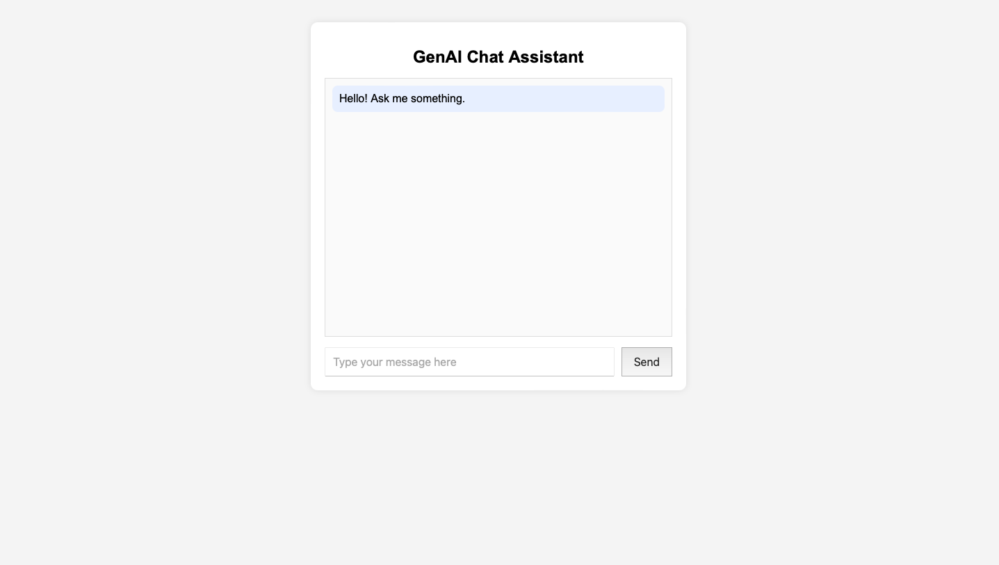
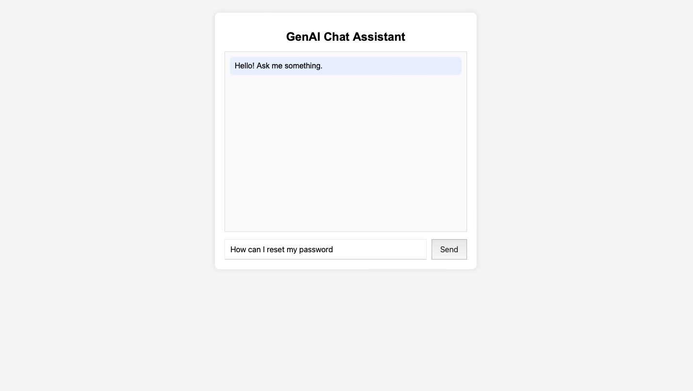
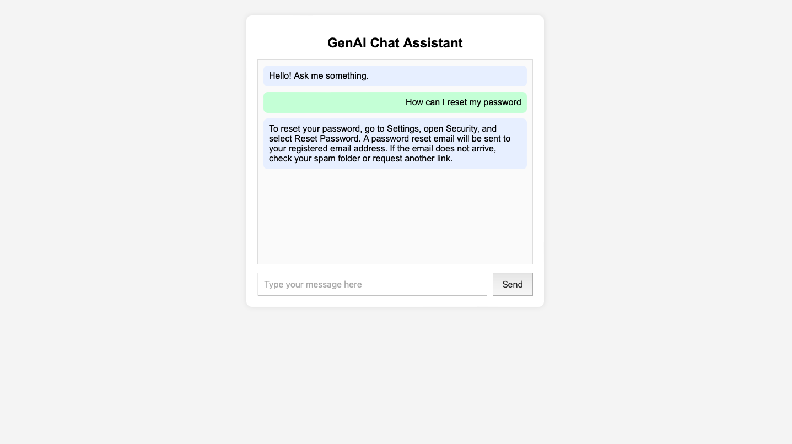

# GenAI RAG Chat Assistant

## Project Overview
This project implements a GenAI-powered chat assistant using Retrieval-Augmented Generation (RAG).  
The assistant retrieves relevant document chunks using embeddings and generates grounded responses using an LLM.

## Tech Stack
- Python (Flask)
- HTML / CSS / JavaScript
- LLM API
- Embeddings
- Vector similarity search
- JSON document storage

## Architecture

User → Chat UI → Flask Backend → Embeddings → Similarity Search → LLM → Response

## RAG Workflow

1. Documents stored in `docs.json`
2. Documents are chunked into smaller pieces
3. Each chunk is converted into embeddings
4. Embeddings are stored in memory / vector store
5. User query is converted into embedding
6. Similarity search retrieves top relevant chunks
7. Retrieved context is injected into the LLM prompt
8. LLM generates the final grounded answer

## Embedding Strategy
Document chunks are converted into vector embeddings using the embeddings API.  
User queries are also converted into embeddings and compared with stored vectors using cosine similarity.

## Similarity Search
The system retrieves the **top 3 most similar document chunks** based on cosine similarity scores.

If similarity is below threshold, the assistant returns a fallback response.

## Prompt Design

The prompt includes:
- Retrieved document context
- Conversation history
- User question

This ensures grounded responses and reduces hallucination.

## Setup Instructions

Clone the repository:

```
git clone https://github.com/EshwarReddy123/genai-chat-assistant.git
```

Install dependencies:

```
pip install -r requirements.txt
```

Run the application:

```
python3 app.py
```

Open browser:

```
http://127.0.0.1:5000
```

## Screenshots

### Chat Interface


### User Question


### Assistant Response


## API Endpoint

POST `/api/chat`

Example Request:

```
{
  "sessionId": "abc123",
  "message": "How can I reset my password?"
}
```

Example Response:

```
{
  "reply": "Users can reset their password from Settings > Security.",
  "tokensUsed": 120,
  "retrievedChunks": 3
}